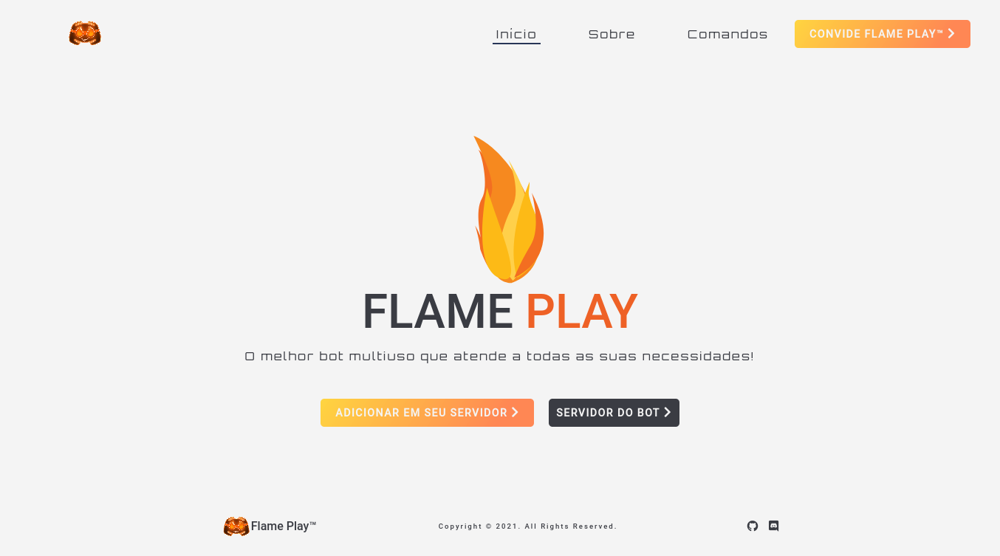

# Flame-Play website
Website for Flame Play, an amazing discord bot for your server.

## Table of contents

- [Overview](#overview)
  - [The challenge](#the-challenge)
  - [Screenshot](#screenshot)
  - [Links](#links)
- [My process](#my-process)
  - [Built with](#built-with)
  - [What I learned](#what-i-learned)
- [Author](#author)

## Overview

### The challenge

-I've created the complete design ui/ux for this project for a client.

### Screenshot

### Links

- Solution URL: [Github repository](https://rafaelgleal.github.io/Flame-Play/)
- Live Site URL: [Live Site](https://flameplay.xyz)

### Built with

- Semantic HTML5 markup
- CSS custom properties
- Flexbox
- CSS Grid
- Mobile-first workflow
- Javascript
- Sass preprocessor

### What I learned

- My first time creating a complete website from zero, all the content of this page was projected and created by me, it's was a really challenge but also a great experience.
- Improve my skills for better optimization.

## Author

- Website - [Rafael G. Leal](https://github.com/RafaelGLeal)
